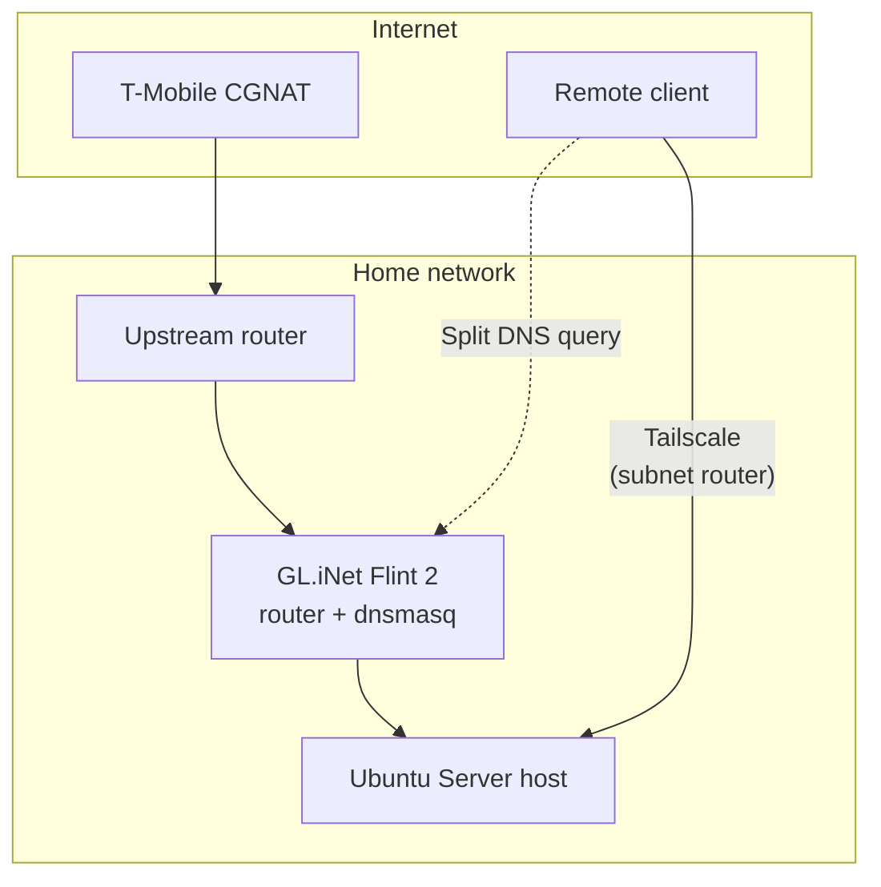
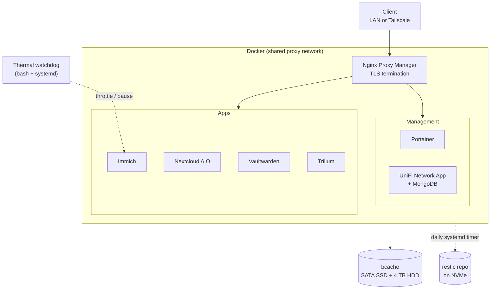

# Homelab

A self-hosted server I built, hardened, and maintain as a hands-on learning project in systems administration, networking, and Docker. Everything here is documented the way I'd hand it off to another engineer: what runs, why it's set up that way, and what broke along the way.

## Highlights

- **Docker Compose stack** behind Nginx Proxy Manager with Let's Encrypt (DNS-01) certificates; services join a shared `proxy` network instead of publishing ports to the host
- **Remote access via Tailscale** running as a subnet router, with split-horizon DNS so internal hostnames resolve correctly on and off the LAN
- **Tiered storage** using bcache (SATA SSD caching a 4 TB HDD) in writeback mode
- **Automated daily backups** with restic, `pg_dump`/`mongodump`, and a systemd timer
- **Thermal watchdog** (bash + systemd) that throttles and pauses containers before the CPU hits its hardware shutdown limit
- **Hardened host:** key-only SSH, default-deny UFW, fail2ban, unattended security updates

## Hardware

| Component | Detail |
|---|---|
| CPU / RAM | Ryzen 5 2600X / 32 GB |
| Boot | 238 GB NVMe |
| Storage | 3.6 TB HDD, cached by a 112 GB SATA SSD (bcache) |
| OS | Ubuntu Server 26.04 LTS |

## Architecture

### Network and remote access



### Host: services, storage, backups



**Traffic flow:** clients reach services by hostname (`*.example.duckdns.org`). Inside the LAN, a dnsmasq override on the router points those names straight at Nginx Proxy Manager. Off the LAN, Tailscale advertises the LAN subnet and uses Split DNS to query the router for the same domain. NPM terminates TLS and forwards to the right container by name.

## Services

| Service | Purpose |
|---|---|
| Nginx Proxy Manager | Reverse proxy, TLS via Let's Encrypt DNS-01 |
| Portainer | Container management UI |
| Immich | Self-hosted photo library |
| Nextcloud AIO | Document and file storage |
| Vaultwarden | Password manager |
| Trilium | Notes |
| UniFi OS Server | Network device management (with MongoDB) |

## Security

- SSH key authentication only
- UFW default-deny inbound; service ports scoped to the LAN subnet
- fail2ban on SSH
- Unattended security updates
- No services exposed to the public internet; remote access goes through Tailscale

Details: [`docs/hardening.md`](docs/hardening.md)

## Troubleshooting write-ups

Each follows *Symptom → Investigation → Root cause → Fix → Takeaway*.

| Write-up | Summary |
|---|---|
| [Docker "address already in use"](docs/troubleshooting/docker-ipam-address-in-use.md) | Errors bouncing between unrelated containers; root cause was an unpinned `proxy` network subnet |
| [Thermal shutdown and watchdog](docs/troubleshooting/thermal-shutdown-and-watchdog.md) | ML workload drove the CPU to its thermal limit; built a tiered throttle/pause watchdog |
| [DNS failures after switching to Tailscale](docs/troubleshooting/duckdns-dns-resolution.md) | Double-NAT and inherited WAN DNS; fixed with split-horizon DNS |
| [UniFi adoption on bridge networking](docs/troubleshooting/unifi-adoption-bridge-networking.md) | L2 discovery doesn't cross Docker bridge; manual `set-inform` workflow |

## Repository layout

```
compose/    Docker Compose files (secrets replaced with .env.example)
scripts/    Thermal watchdog, backup script, systemd units
system/     sysctl, Tailscale GRO unit, wait-for-internet unit
docs/       Architecture, hardening, networking, storage/backups, troubleshooting
```

## Lessons learned

- Pin Docker network subnets explicitly; auto-assigned ranges can change after a daemon state reset and silently break anything with a static IP.
- Failures can be masked by another layer. DNS problems only surfaced once a tool that had been intercepting DNS was replaced.
- Keep the stack small. Fewer services doing their jobs well beats a sprawl of half-maintained ones.
- Monitor before you need to. The thermal issue was caught only after a forced shutdown; the watchdog now handles it before that point.

## Notes

Domains, IPs, and credentials in this repo are placeholders. No real secrets are committed.
